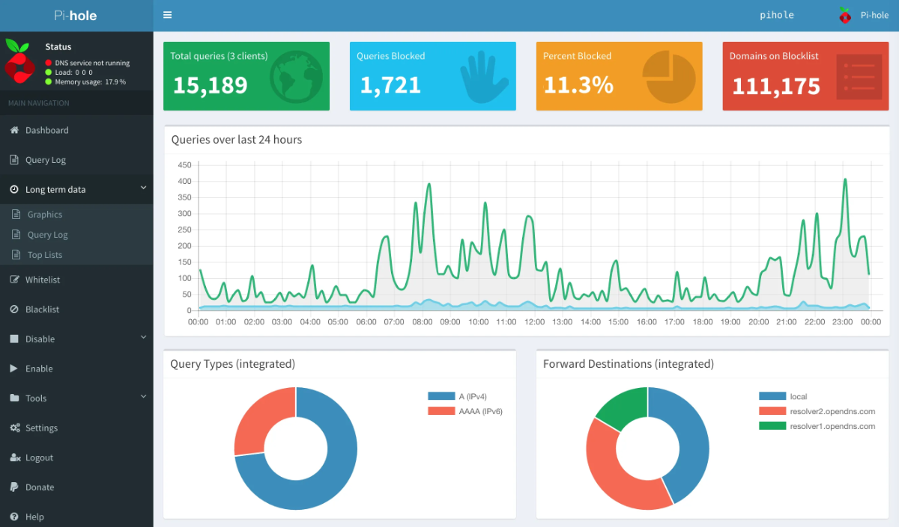

<!--
N.B.: This README was automatically generated by https://github.com/YunoHost/apps/tree/master/tools/README-generator
It shall NOT be edited by hand.
-->

# Pi-hole pour YunoHost

[](https://dash.yunohost.org/appci/app/pihole)    
[](https://install-app.yunohost.org/?app=pihole)

*[Read this readme in english.](./README.md)*

> *Ce package vous permet d'installer Pi-hole rapidement et simplement sur un serveur YunoHost.
Si vous n'avez pas YunoHost, regardez [ici](https://yunohost.org/#/install) pour savoir comment l'installer et en profiter.*

## Vue d'ensemble

The Pi-hole® is a DNS sinkhole that protects your devices from unwanted content without installing any client-side software.

**Version incluse :** 5.11.4~ynh1

## Captures d'écran



## Avertissements / informations importantes

## Configuration

Utiliser le panneau d'administration de votre Pi-hole pour configurer cette application. Vous devrez peut-être aussi suivre le [guide de post-installation](https://docs.pi-hole.net/main/post-install/) pour configurer Pi-hole en tant que *serveur DNS* ou *serveur DHCP*.

## Limitations

* Activer DHCP avec Pi-hole nécessite une configuration manuelle de votre routeur.

## Faire de Pi-hole votre serveur DHCP

> **Attention, vous devez savoir que toucher à votre DHCP pourrait casser votre réseau.  
Dans le cas où votre serveur serait inaccessible, vous perdriez votre résolution dns et votre adresse IP.  
Ainsi, vous perdriez toute connexion à internet et même la connexion à votre routeur.**

> **Si vous rencontrez ce genre de problèmes, merci de lire la section "Comment restaurer mon réseau" à la fin de ce document.**

### Comment configurer Pi-hole

Il y a 2 manière de configurer Pi-hole pour qu'il soit utilisé comme votre serveur DHCP.
- Soit vous pouvez choisir de l'utiliser lorsque vous installez l'application.
- Soit vous pouvez activer le serveur DHCP par la suite dans l'onglet "Settings", partie "Pi-hole DHCP Server".  
Dans ce second cas, il peut être préférable de forcer l'ip du serveur à une adresse statique.

### Comment configurer mon routeur

Votre routeur ou celui de votre FAI dispose d'un serveur DHCP activé par défaut.  
Si vous gardez ce DHCP, en même temps que celui de Pi-hole, vous allez avoir des conflits transparents entre eux.  
Le premier serveur DHCP à répondre va distribuer ses propres ip et paramètres.  
Donc vous devez éteindre le serveur DHCP de votre routeur et laisser Pi-hole gérer votre réseau.

#### Pourquoi je devrais utiliser le DHCP de Pi-hole ?

En utilisant le DHCP de Pi-hole, vous lui permettez de donner sa configuration dns à chacun de vos clients. De cette manière, chaque requête sera filtrée par Pi-hole.

Un autre cas d'usage du DHCP de Pi-hole est le cas où vous rencontrez des problèmes de hairpinning (Vous ne pouvez pas vous connecter à votre serveur parce que son ip est votre ip publique, et votre routeur n'autorise pas cela).  
Dans ce cas, utilisez le dns de Pi-hole va vous permettre de vous connecter à votre serveur par son adresse locale plutôt que son adresse publique.

### Comment restaurer mon réseau

> Oups !  
Votre serveur Pi-hole est tombé, et vous n'avez plus de DHCP.  
Ne paniquez pas, on va surmonter ça \o/

Utilisez votre terminal favori sur votre ordinateur de bureau.  
Et tout d'abord, récupérer votre interface réseau (Le plus souvent `eth0`).
``` bash
sudo ifconfig
```

Ensuite, changer votre ip pour une ip statique.
``` bash
sudo ifconfig eth0 192.168.1.100
```

Maintenant, vous pouvez vous connecter à votre routeur et rallumer son serveur DHCP pour l'utiliser à nouveau.  
Vous pouvez maintenant retirer votre ip statique et réobtenir une ip dynamique.
``` bash
sudo ifconfig eth0 0.0.0.0 && sudo dhclient eth0
```

> N'oubliez pas d'éteindre le DHCP de votre routeur si votre serveur fonctionne à nouveau.

## Documentations et ressources

* Site officiel de l'app : <https://pi-hole.net/>
* Documentation officielle de l'admin : <https://docs.pi-hole.net>
* Dépôt de code officiel de l'app : <https://github.com/pi-hole/pi-hole/>
* Documentation YunoHost pour cette app : <https://yunohost.org/app_pihole>
* Signaler un bug : <https://github.com/YunoHost-Apps/pihole_ynh/issues>

## Informations pour les développeurs

Merci de faire vos pull request sur la [branche testing](https://github.com/YunoHost-Apps/pihole_ynh/tree/testing).

Pour essayer la branche testing, procédez comme suit.

``` bash
sudo yunohost app install https://github.com/YunoHost-Apps/pihole_ynh/tree/testing --debug
ou
sudo yunohost app upgrade pihole -u https://github.com/YunoHost-Apps/pihole_ynh/tree/testing --debug
```

**Plus d'infos sur le packaging d'applications :** <https://yunohost.org/packaging_apps>
